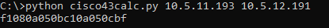

[](https://developer.cisco.com/codeexchange/github/repo/wifiwizardofoz/cisco43calc)
# cisco43calc
A python DHCP Option 43 Generator for Cisco Lightweight APs

**cisco43calc.py**

**Author:** Brett Verney</br>
**Version:** v2.0 | 30-6-2023

This script converts a list of user supplied IP addresses to a TLV hexadecimal string required for DHCP Option 43 as used by Cisco Lightweight Access Point (LWAPPs) for discovering Cisco Wireless LAN Controllers (WLCs).

It simply asks the user for the number of WLCs to be used in a network, returns a prompt requesting the IP address of each, and converts the items to a complete DHCP Option 43 string.

## Background

A common method for a Cisco LWAPPs to discover and join a Cisco WLC is to specify a list of WLC IP addresses within the vendor specific DHCP Option 43, which can be returned by a DHCP server within a DHCP Offer message. The AP however, requires the value to be returned in hexadecimal format by specifying a concatenated string comprised of Type-Length-Value (TLV) blocks as follows:

**Type + Length + Value**

where:

Type = f1 (Defines a hex string is to follow)<br/>
Length = Number of WLCs to follow x 4 (listed in hex)<br/>
Value = List of WLC Management IP addresses (listed in hex)

**Example:**

There are two WLCs in a Wireless Network - 

WLC#1 = 10.5.11.193<br/>
WLC#2 = 10.5.12.191<br/>

The TLV blocks required are:

Type = f1<br/>
Length = 08<br/>
WLC#1 in hex = 0a050bc1<br/>
WLC#2 in hex = 0a050cbf

When we assemble the string, we get **f1080a050bc10a050cbf**. This can be copy and pasted in to any DHCP Server that support the use of Option 43.

## Usage

### Windows

**Interactive Mode** - ```python cisco43calc.py```


**Argument Mode** - ```python cisco43calc.py <ip_address_1> <ip address_2> <ip_address_x>```


### MAC/OSX & Linux

**Interactive Mode** -```python ./cisco43calc.py```

**Argument Mode** - ```python ./cisco43calc.py <ip_address_1> <ip address_2> <ip_address_x>```

**Note:**
*If you have both Python 2 and Python 3 installed you should run* ```python3 ./cisco43calc.py```

### Examples
#### Interactive Mode


#### Argument Mode



## Special Thanks
[Yauhen Shulitski](https://github.com/jsnjack) for the advice on arg parsing.
